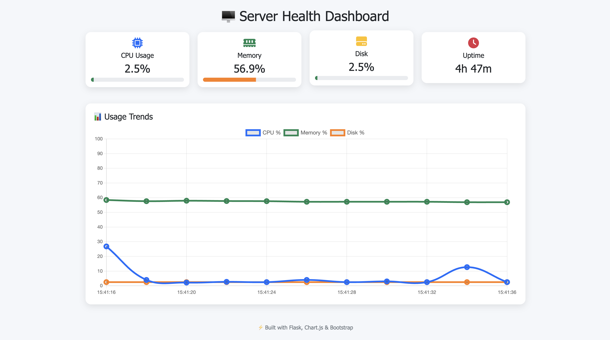

# 🖥️ Server Health Dashboard  

A **real-time system monitoring dashboard** built with **Flask, psutil, Chart.js, and Bootstrap**.  
It gives you a clean, modern, and interactive way to track your **CPU, Memory, Disk usage, and Uptime** — all in one place.  



---

## ✨ Features  

✅ **Real-time monitoring** – CPU, memory, disk usage, and uptime  
✅ **Beautiful interactive charts** – powered by Chart.js  
✅ **Color-coded alerts** – Green = Good, Orange = Warning, Red = Critical  
✅ **Responsive UI** – works on desktop, tablet, and mobile  
✅ **Email & Slack notifications** – configurable alerts for high usage  
✅ **Lightweight & Dockerized** – easy to run anywhere  

---

## 🚀 Tech Stack  

- **Backend:** Python, Flask, psutil  
- **Frontend:** Bootstrap 5, Chart.js, Font Awesome  
- **Alerts:** SMTP (Email), Slack Webhooks  
- **Deployment:** Docker, Gunicorn-ready  

---

## 📂 Project Structure  

Server-Health-Dashboard/
│── 01.App.py # Flask backend (API + routes)

│── monitor.py # System stats collection & logging

│── alert.py # Email & Slack alerts

│── requirements.txt # Python dependencies

│── Dockerfile # Containerized deployment

│── templates/
│ └── index.html # Main dashboard UI
│── assets/
│ └── dashboard_preview.png
│── logs/
│ └── system_log.txt # (auto-generated logs)


---

## ⚡ Installation & Usage  

### 1️⃣ Clone the repository  
```bash
git clone https://github.com/YOUR-USERNAME/Server-Health-Dashboard.git
cd Server-Health-Dashboard
```
### 2️⃣ Install dependencies
pip install -r requirements.txt

### 3️⃣ Run the app
python 01.App.py


## 🐳 Run with Docker
docker build -t server-health-dashboard .
docker run -p 8080:8080 server-health-dashboard

## 🔔 Alerts Setup
### 📩 Email Alerts

Edit alert.py and update your Gmail & App Password:

SENDER = "your_email@gmail.com"
PASSWORD = "your_app_password"
RECEIVER = "receiver@gmail.com"

### 💬 Slack Alerts

Create a Slack Webhook URL and paste it in alert.py:

SLACK_WEBHOOK = "https://hooks.slack.com/services/XXXX/XXXX/XXXX"

##💡 Future Improvements

- ⏱ Historical stats with database (SQLite/InfluxDB)

- 📈 Zoom & Pan in charts (Chart.js plugin)

- 🌓 Dark mode toggle

- 🌐 Remote server monitoring support


## 🤝 Contributing

Contributions, issues, and feature requests are welcome!
Feel free to fork the repo and submit a PR.

📜 License

MIT License © 2025 – Built with ❤️ by {Rahul Sharma}

