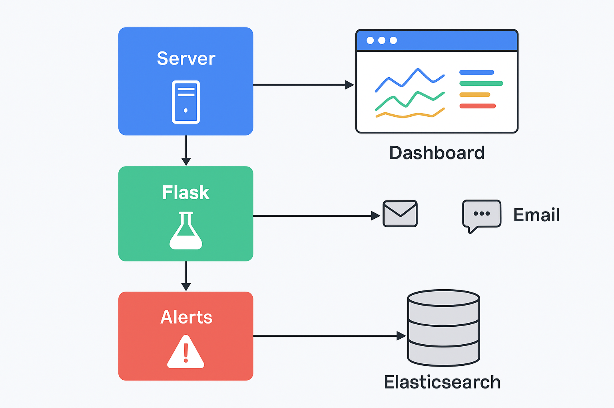

# 🖥️ Server Health Dashboard  

A **real-time system monitoring dashboard** built with **Flask, psutil, Chart.js, and Bootstrap**.  
It gives you a clean, modern, and interactive way to track your **CPU, Memory, Disk usage, and Uptime** — all in one place.  


## 🔎 Project Architecture



---

## ✨ Features  

✅ **Real-time monitoring** – CPU, memory, disk usage, and uptime  
✅ **Beautiful interactive charts** – powered by Chart.js  
✅ **Color-coded alerts** – Green = Good, Orange = Warning, Red = Critical  
✅ **Responsive UI** – works on desktop, tablet, and mobile  
✅ **Email & Slack notifications** – configurable alerts for high usage  
✅ **Lightweight & Dockerized** – easy to run anywhere  
✅ **Kubernetes-ready** – deployable on any K8s cluster
✅ **CI/CD with GitHub Actions** – automated testing & Docker builds
✅ **Extensible logging pipeline** – Logstash + Elasticsearch + Prometheus

---

## 🚀 Tech Stack  

- **Backend:** Python, Flask, psutil  
- **Frontend:** Bootstrap 5, Chart.js, Font Awesome  
- **Alerts:** SMTP (Email), Slack Webhooks  
- **Deployment:** Docker, Gunicorn-ready  
- **Monitoring:** Prometheus, Logstash, Elasticsearch
---

## 📂 Project Structure  

Server-Health-Dashboard/
│── 01.App.py              # Flask backend
│── monitor.py             # System stats collection & logging
│── alert.py               # Alerts (Email + Slack)
│── test_app.py            # Unit tests
│── requirements.txt       # Python dependencies
│── Dockerfile             # Container image build
│── .github/
│   └── workflows/
│       └── ci-cd.yml      # GitHub Actions CI/CD pipeline
│── kubernetes/
│   ├── deployment.yaml    # Kubernetes Deployment + Service
│   └── prometheus.yml     # Prometheus scrape config
│── logstash/
│   └── logstash.conf      # Logstash pipeline config
│── terraform/
│   └── main.tf            # AWS Terraform config
│── templates/
│   └── index.html         # Dashboard UI
│── logs/
│   └── system_log.txt     # Auto-generated log file
│── assets/
│   └── dashboard_preview.png
│── README.md              # Documentation


---

## ⚡ Installation & Usage  

### 1️⃣ Clone the repository  
```bash
git clone https://github.com/YOUR-USERNAME/Server-Health-Dashboard.git
cd Server-Health-Dashboard
```
### 2️⃣ Install dependencies
pip install -r requirements.txt

### 3️⃣ Run the app
python 01.App.py


## 🐳 Run with Docker
docker build -t server-health-dashboard .

docker run -p 8080:8080 server-health-dashboard

## ☸️ Deploy on Kubernetes
kubectl apply -f kubernetes/deployment.yaml

kubectl get svc monitoring-app-service


## 🔔 Alerts Setup
### 📩 Email Alerts

Edit alert.py and update your Gmail & App Password:

SENDER = "your_email@gmail.com"
PASSWORD = "your_app_password"
RECEIVER = "receiver@gmail.com"

### 💬 Slack Alerts

Create a Slack Webhook URL and paste it in alert.py:

SLACK_WEBHOOK = "https://hooks.slack.com/services/XXXX/XXXX/XXXX"

##💡 Future Improvements

- ⏱ Historical stats with database (SQLite/InfluxDB)

- 📈 Zoom & Pan in charts (Chart.js plugin)

- 🌓 Dark mode toggle

- 🌐 Remote server monitoring support

## 📊 Monitoring Stack

- Prometheus – Scrapes metrics from the Flask app

- Logstash – Forwards logs to Elasticsearch

- Elasticsearch – Stores system metrics

- Kibana (optional) – Visualize logs/metrics

Configs:

-  kubernetes/prometheus.yml – Prometheus scraping

- logstash/logstash.conf – Logstash pipeline

## 🛠️ CI/CD

- Linting (flake8, mypy)

- Unit tests (pytest)

- Docker image build

- Automated via GitHub Actions (.github/workflows/ci-cd.yml)

🌐 Terraform (AWS S3 Logging)
 
- cd terraform
- terraform init
- terraform apply


## 🤝 Contributing

Contributions, issues, and feature requests are welcome!
Feel free to fork the repo and submit a PR.

📜 License

MIT License © 2025 – Built with ❤️ by {Rahul Sharma}

